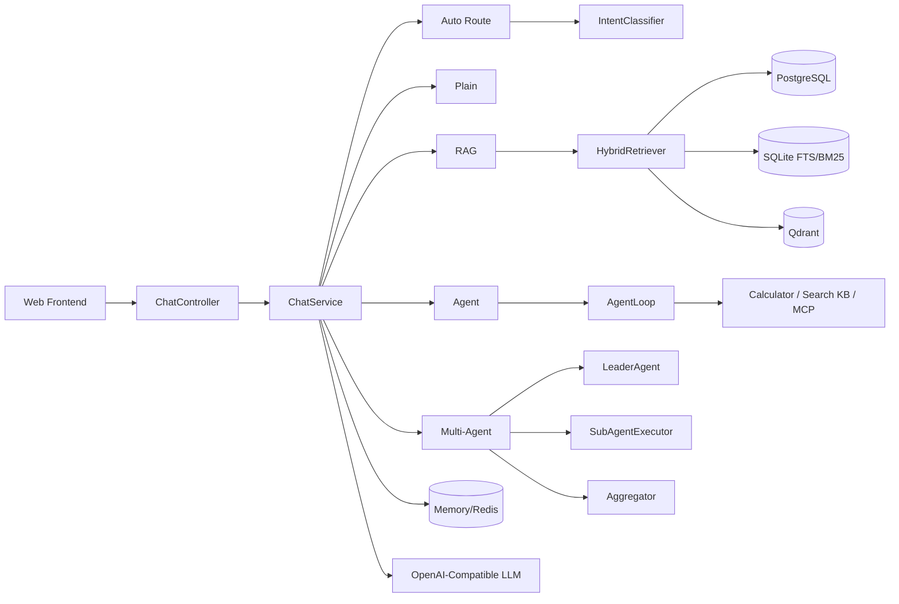

# agentic-rag

从零自研的 Java 17 Agentic RAG 项目：包含混合检索、Agent 工具循环、多 Agent 编排、会话记忆，以及 M6 引入的离线评测、容器化和 K8s 最小部署清单。

## 架构图



## 快速开始

### 1. 本地启动

```bash
export LLM_API_KEY=sk-xxx
export LLM_BASE_URL=https://api.siliconflow.cn/v1
export LLM_CHAT_MODEL=zai-org/GLM-5.3
export LLM_EMBEDDING_MODEL=Qwen/Qwen3-Embedding-8B

docker compose up -d postgres qdrant redis
./mvnw spring-boot:run
```

页面地址：`http://localhost:8081`

### 2. 一条命令拉起容器环境

```bash
export LLM_API_KEY=sk-xxx
docker compose up -d --build
```

健康检查：

```bash
curl http://localhost:8081/api/health
```

### 3. K8s 最小部署

```bash
kubectl apply -f deploy/k8s/configmap.yaml
kubectl apply -f deploy/k8s/deployment.yaml
kubectl apply -f deploy/k8s/service.yaml
```

`deployment.yaml` 里预留了 `agentic-rag-secrets/LLM_API_KEY` 的 Secret 引用。

## 评测

M6 提供了 `eval` profile，会使用内置语料自动入库并跑离线评测。

```bash
export LLM_API_KEY=sk-xxx
./mvnw spring-boot:run -Dspring-boot.run.profiles=eval
```

运行结果会输出到项目根目录的 `eval-report.md`，包含：

- 回答准确率（关键词 F1）
- Recall@10
- 引用有效率
- 工具调用成功率
- 意图路由准确率
- 每题明细

## 外部基准（EnterpriseRAG-Bench）

在 [EnterpriseRAG-Bench](https://github.com/onyx-dot-app/EnterpriseRAG-Bench)（Onyx，MIT）的
Confluence 子集上做了真实栈评测：**5,186 篇语料全量入库（PG + Qdrant + SQLite FTS5），64 题**，
走与线上一致的 `ChatService` 链路作答后由官方脚本判分。

| 指标 | 基线（2026-09-16） | 说明 |
|---|---:|---|
| Document Recall | 48.4% | 检索：引用命中标准答案文档的比例 |
| Completeness | 29.7% | 生成：答案覆盖官方事实点的比例 |
| Correctness | 14.1% | 生成：LLM judge 整体判对比例 |
| Invalid Extra Docs | 3.55 / 题 | 平均多余引用文档数 |

> Judge 为 GLM-5.3（SiliconFlow，OpenAI 兼容适配），非官方默认 GPT 系，绝对分值与官方口径不完全可比。
> 分题型拆解、失败模式分析与接入流程见 `docs/plan/M6-EnterpriseRAG-Bench接入Runbook.md`
> 与 `docs/issues/2026-09-16-enterpriserag-bench首次评测报告与踩坑记录.md`。
> 该基线为优化前版本，检索/生成双层优化与复测提升见后续 commit。

## API

| 方法 | 路径 | 说明 |
|---|---|---|
| POST | `/api/chat` | SSE 聊天入口，body: `{"sessionId":"s1","message":"...","mode":"auto|plain|rag|agent|multi-agent"}` |
| DELETE | `/api/memory/{sessionId}` | 清空会话记忆 |
| GET | `/api/health` | 健康检查 |
| POST | `/api/ingest` | 文档入库 |
| GET | `/api/documents` | 查看文档列表 |

SSE 事件：

| event | 含义 |
|---|---|
| `thinking` | 思考过程 / 路由 / 工具 / 多 Agent 阶段事件 |
| `delta` | 回答流式增量 |
| `done` | 回答完成，携带 `sources` |
| `error` | 输入错误或链路异常 |

## 工程说明

- 配置全部通过环境变量注入，仓库内不保存真实密钥
- `ChatService` 作为统一链路入口，Web 与评测复用同一业务路径
- `eval` profile 使用 H2 + 内置语料 + 词法 embedding stub，保证评测数据可复现
- Dockerfile 采用多阶段构建，运行时镜像只包含 JRE 和应用 jar

## 里程碑

- [x] M1 骨架：LLM 流式对话 + 聊天界面
- [x] M2 RAG：入库、混合检索、RRF
- [x] M3 Agent：状态机 + 工具循环
- [x] M4 体验：意图路由、来源展示、持久化记忆
- [x] M5 多 Agent：Leader / SubAgent / Aggregator
- [x] M6 工程化：评测、Docker、K8s、README
